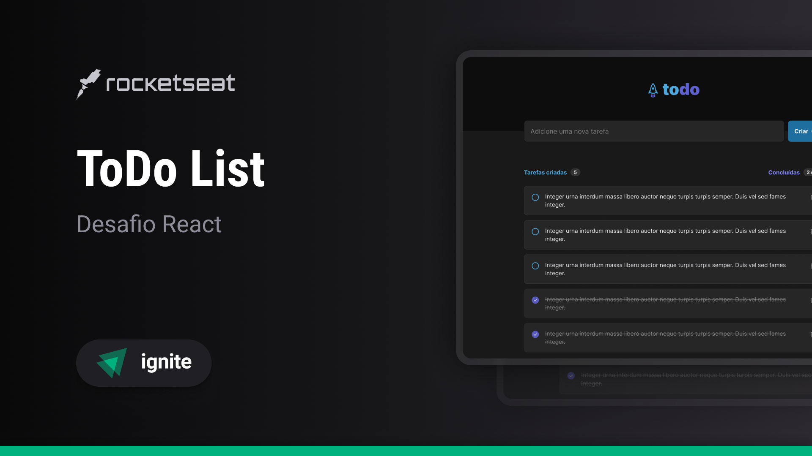

# 📌 To-Do List

Um simples e eficiente aplicativo de lista de tarefas desenvolvido com **React**, **TypeScript** e **CSS Modules**.



## 🚀 Funcionalidades

✅ Adicionar uma nova tarefa<br>
✅ Marcar e desmarcar uma tarefa como concluída<br>
✅ Remover uma tarefa da listagem<br>
✅ Exibir progresso de conclusão das tarefas

## 🛠 Tecnologias Utilizadas

- ⚛️ **React** – Biblioteca para construção da UI
- 📜 **TypeScript** – Tipagem estática para um código mais seguro
- 🎨 **CSS Modules** – Estilização modular e otimizada
- 🔗 **Phosphor Icons** – Ícones leves e personalizáveis

## 🏗 Conceitos Aplicados

Este projeto reforça conceitos essenciais do React, como:

- 📌 **Estados** – Gerenciamento eficiente do estado das tarefas
- 🔄 **Imutabilidade** – Atualização correta dos dados sem mutações
- 🔑 **Listas e Chaves** – Renderização otimizada de elementos
- 🏗 **Componentização** – Organização modular e reutilizável
- 🎯 **Propriedades** – Comunicação eficaz entre componentes

## 🎨 Layout da Aplicação

A interface foi projetada para ser intuitiva e minimalista, garantindo uma ótima experiência de usuário. Você pode personalizar o design conforme sua necessidade!

## ⚙️ Como Executar o Projeto

1. Clone este repositório:

   ```bash
   git clone https://github.com/seu-usuario/todo-list-react.git
   ```

2. Acesse o diretório do projeto:

   ```bash
   cd todo-list-react
   ```

3. Instale as dependências:

   ```bash
   npm install
   # ou
   yarn install
   ```

4. Inicie o projeto:
   ```bash
   npm run dev
   # ou
   yarn dev
   ```

A aplicação estará disponível em `http://localhost:5173/` 🚀

## 📌 Próximos Passos

🚀 Melhorias futuras podem incluir:

- 🔔 Notificações para tarefas pendentes
- 📅 Integração com calendário
- 📊 Estatísticas de produtividade

---

💡 **Dica:** Sinta-se à vontade para customizar e expandir este projeto! 🛠️
